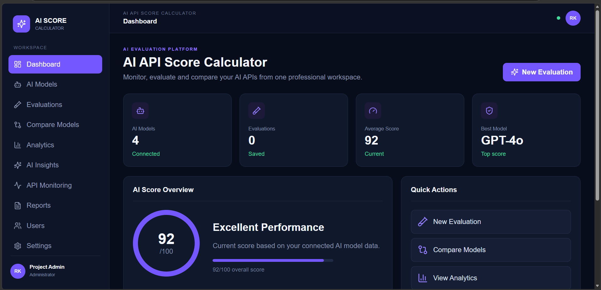
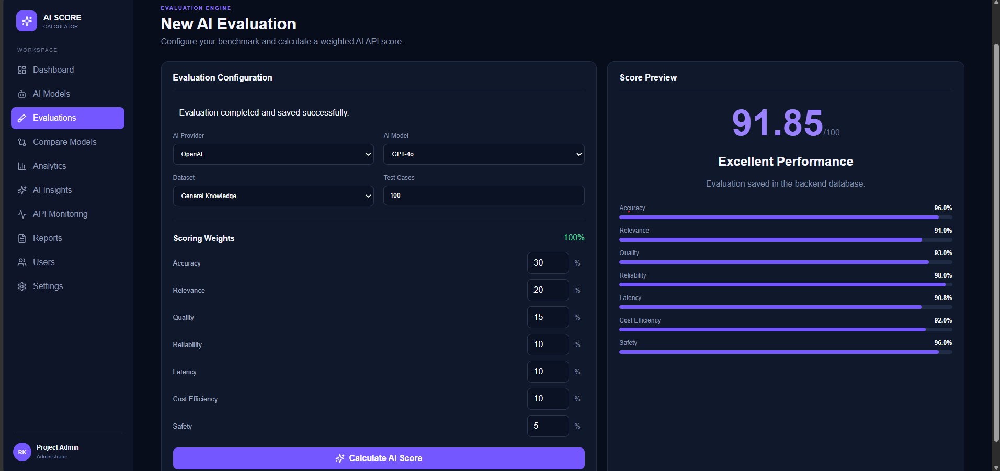
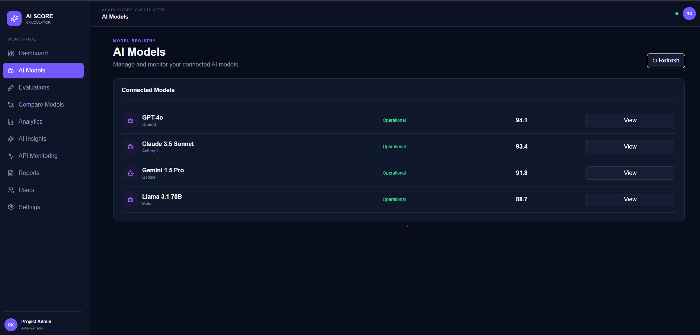
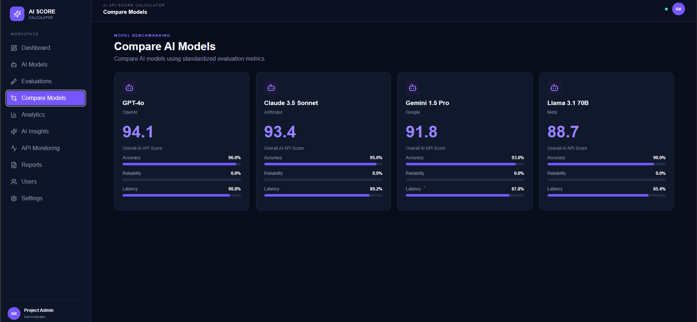
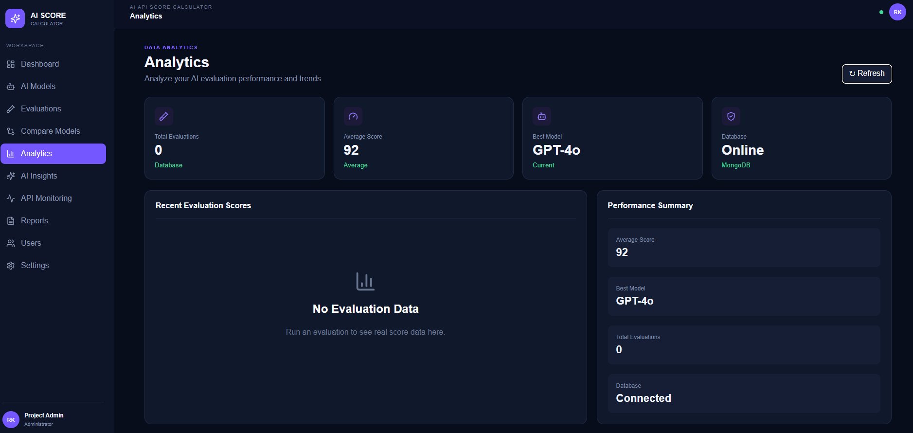
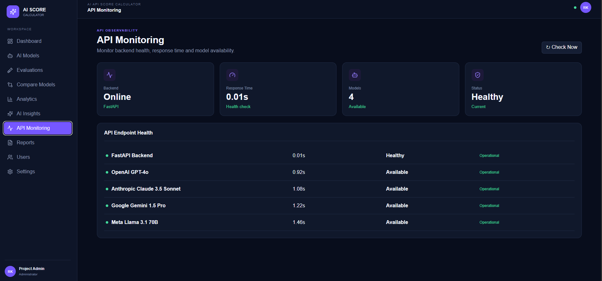
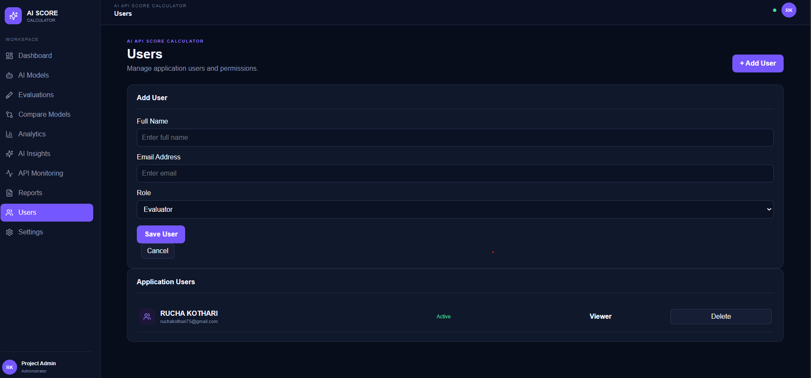

# 🤖 AI API Score Calculator

<p align="center">
  <strong>A Full-Stack Platform for Evaluating, Comparing and Analyzing AI APIs</strong>
</p>

<p align="center">
  Evaluate AI models using Accuracy, Relevance, Quality, Reliability, Latency, Cost and Safety.
</p>

---

## 📌 About the Project

The **AI API Score Calculator** is a full-stack web application designed to evaluate, score, compare, and analyze the performance of different AI APIs and AI models.

With the rapid growth of Artificial Intelligence and Large Language Models (LLMs), choosing the right AI API for a specific application can be challenging.

This project provides a structured evaluation system that allows users to assess AI models using multiple performance metrics and generate an overall score.

The application presents evaluation results through an interactive dashboard with model comparison, analytics, insights, monitoring, and user management features.

---

# 🎯 Objectives

- Evaluate different AI APIs using standardized metrics.
- Calculate an overall AI API performance score.
- Compare multiple AI models.
- Analyze model performance using interactive analytics.
- Monitor important AI API performance indicators.
- Help users select suitable AI models for different applications.
- Provide a centralized platform for AI API evaluation and analysis.

---

# ✨ Key Features

### 📊 Dashboard
- Overall performance overview
- Model scores
- Evaluation statistics
- Performance metrics
- Quick access to application modules

### 🧪 AI Model Evaluation
Evaluate AI APIs using:
- Accuracy
- Relevance
- Quality
- Reliability
- Latency
- Cost
- Safety

### 🤖 AI Models
View available AI models and their performance.

Example models:
- GPT-4o
- Claude 3.5 Sonnet
- Gemini 1.5 Pro
- Llama 3.1 70B

### ⚖️ Model Comparison
Compare models using overall score, accuracy, latency, reliability, cost, and other evaluation metrics.

### 📈 Analytics
Analyze evaluation statistics, model performance, metric performance, score distributions, and trends.

### 💡 Insights
Understand evaluation results and identify high-performing models.

### 🖥️ Monitoring
Monitor latency, reliability, API performance, model performance, and evaluation metrics.

### 👥 Users
Provides a centralized interface for viewing and managing user-related information.

---

# 🧮 Evaluation Metrics

| Metric | Weight |
|---|---:|
| Accuracy | 30% |
| Relevance | 20% |
| Quality | 15% |
| Reliability | 10% |
| Latency | 10% |
| Cost | 10% |
| Safety | 5% |
| **Total** | **100%** |

The weighted metrics are used to generate an overall AI API score.

---

# 🏗️ System Architecture

```text
                         ┌─────────────────────┐
                         │        USER         │
                         └──────────┬──────────┘
                                    │
                                    ▼
                         ┌─────────────────────┐
                         │   REACT FRONTEND    │
                         │                     │
                         │ • Dashboard         │
                         │ • Evaluation        │
                         │ • Models            │
                         │ • Comparison        │
                         │ • Analytics         │
                         │ • Insights          │
                         │ • Monitoring        │
                         │ • Users             │
                         └──────────┬──────────┘
                                    │
                              REST API
                                    │
                                    ▼
                         ┌─────────────────────┐
                         │   FASTAPI BACKEND   │
                         │                     │
                         │ • API Routes        │
                         │ • Scoring Logic     │
                         │ • Evaluations       │
                         │ • Analytics         │
                         │ • Model Data        │
                         └──────────┬──────────┘
                                    │
                                    ▼
                         ┌─────────────────────┐
                         │       MONGODB       │
                         │                     │
                         │ • Evaluation Data   │
                         │ • Model Data        │
                         │ • Application Data  │
                         └─────────────────────┘
```

---

# 🛠️ Technologies Used

### Frontend
- React.js
- JavaScript
- Vite
- CSS
- Lucide React

### Backend
- Python
- FastAPI
- Uvicorn
- Pydantic

### Database
- MongoDB

### Development Tools
- Visual Studio Code
- Git
- GitHub
- PowerShell

---

# 📂 Project Structure

```text
AI-API-Score-Calculator/
│
├── AI_API_Score_Calculator_Backend/
├── backend/
│   ├── app/
│   │   ├── routes/
│   │   ├── services/
│   │   ├── config.py
│   │   ├── database.py
│   │   ├── schemas.py
│   │   └── main.py
│   ├── main.py
│   ├── requirements.txt
│   └── README.md
│
├── database/
│   ├── mongodb_schema.js
│   ├── neo4j_schema.cypher
│   └── postgres_schema.sql
│
├── frontend/
│   ├── src/
│   │   ├── main.jsx
│   │   └── styles.css
│   ├── index.html
│   ├── package.json
│   └── package-lock.json
│
├── screenshots/
│   ├── dashboard.png
│   ├── evaluation.png
│   ├── models.png
│   ├── comparison.png
│   ├── analytics.png
│   ├── monitoring.png
│   └── users.png
│
├── .gitignore
└── README.md
```

---

# 📸 Application Screenshots

## 🏠 Dashboard



## 🧪 AI Model Evaluation



## 🤖 AI Models



## ⚖️ Model Comparison



## 📈 Analytics



## 🖥️ Monitoring



## 👥 Users



---

# 🔌 API Endpoints

| Endpoint | Method | Description |
|---|---|---|
| `/` | GET | Backend status |
| `/api/health` | GET | Health check |
| `/api/models` | GET | Retrieve available AI models |
| `/api/evaluations` | GET | Retrieve evaluations |
| `/api/score` | POST | Calculate AI API score |
| `/api/analytics/summary` | GET | Retrieve analytics summary |

FastAPI Swagger Documentation:

```text
http://localhost:8000/docs
```

---

# ⚙️ Installation & Setup

## 1. Clone the Repository

```bash
git clone https://github.com/ruchakothari2011/AI-API-Score-Calculator.git
cd AI-API-Score-Calculator
```

---

# 🔙 Backend Setup

Navigate to the backend:

```bash
cd backend
```

Create a Python virtual environment:

```bash
python -m venv venv
```

Activate it on Windows:

```powershell
.env\Scriptsctivate
```

Install dependencies:

```bash
pip install -r requirements.txt
```

Start the FastAPI server:

```bash
python -m uvicorn app.main:app --reload --port 8000
```

Backend:

```text
http://localhost:8000
```

FastAPI documentation:

```text
http://localhost:8000/docs
```

---

# 🎨 Frontend Setup

Open another terminal:

```bash
cd frontend
```

Install dependencies:

```bash
npm install
```

Start the development server:

```bash
npm run dev
```

The frontend will normally run at:

```text
http://localhost:5174
```

---

# 🔗 Frontend + Backend

```text
React Frontend
      │
      │ HTTP / REST API
      ▼
FastAPI Backend
      │
      ▼
MongoDB Database
```

---

# 📊 Example Models

| Model | Provider |
|---|---|
| GPT-4o | OpenAI |
| Claude 3.5 Sonnet | Anthropic |
| Gemini 1.5 Pro | Google |
| Llama 3.1 70B | Meta |

---

# 🚀 Application Workflow

```text
1. User opens the application
              ↓
2. Dashboard displays overview
              ↓
3. User selects an AI model
              ↓
4. User evaluates the model
              ↓
5. Evaluation metrics are processed
              ↓
6. Overall score is calculated
              ↓
7. Results are stored/retrieved
              ↓
8. User compares models
              ↓
9. Analytics provide performance insights
              ↓
10. Monitoring tracks important metrics
```

---

# 🎯 Use Cases

- AI developers
- Software developers
- Students
- Researchers
- AI application teams
- Organizations evaluating LLM APIs
- Developers choosing an AI model for an application

---

# 🔐 Security

Sensitive information such as API keys, passwords, and database credentials should never be committed to GitHub.

Use environment variables for sensitive configuration.

```text
.env
```

The `.env` file should be excluded using `.gitignore`.

Example configuration files such as:

```text
.env.example
```

can be committed when appropriate.

---

# 📚 Learning Outcomes

This project provides practical experience in:

- Full-stack web development
- React.js
- FastAPI
- Python
- REST API development
- MongoDB
- Frontend-backend integration
- AI/LLM evaluation
- Data analytics
- Performance monitoring
- Git
- GitHub
- Software project organization

---

# 🔮 Future Enhancements

- Integration with more AI providers
- Real-time API testing
- Automated benchmarking
- Historical score tracking
- AI model recommendation system
- Advanced analytics
- PDF report generation
- CSV report export
- Authentication
- Role-based access control
- Cloud deployment
- Real-time monitoring
- Additional AI evaluation metrics

---

# 🌟 Why This Project?

Selecting an AI API should not depend only on popularity or model name.

Different AI models can perform differently depending on:

- Accuracy requirements
- Response quality
- Response speed
- Reliability
- Cost
- Safety
- Relevance to the task

The **AI API Score Calculator** provides a structured way to evaluate these factors and make better AI model selection decisions.

---

# 📌 Project Highlights

- ✅ Full-stack web application
- ✅ React-based user interface
- ✅ FastAPI REST backend
- ✅ MongoDB database integration
- ✅ Multi-metric AI evaluation
- ✅ Weighted scoring system
- ✅ AI model comparison
- ✅ Analytics dashboard
- ✅ Performance monitoring
- ✅ User management interface
- ✅ GitHub version control

---

# 👩‍💻 Author

## Rucha Kothari

**AI API Score Calculator — Full-Stack AI Evaluation Platform**

GitHub:  
https://github.com/ruchakothari2011/AI-API-Score-Calculator

---

# ⭐ Repository

If you find this project useful, consider giving the repository a ⭐ on GitHub.

**Repository:**  
https://github.com/ruchakothari2011/AI-API-Score-Calculator

---

# 📄 License

This project is developed for **educational and academic purposes**.
